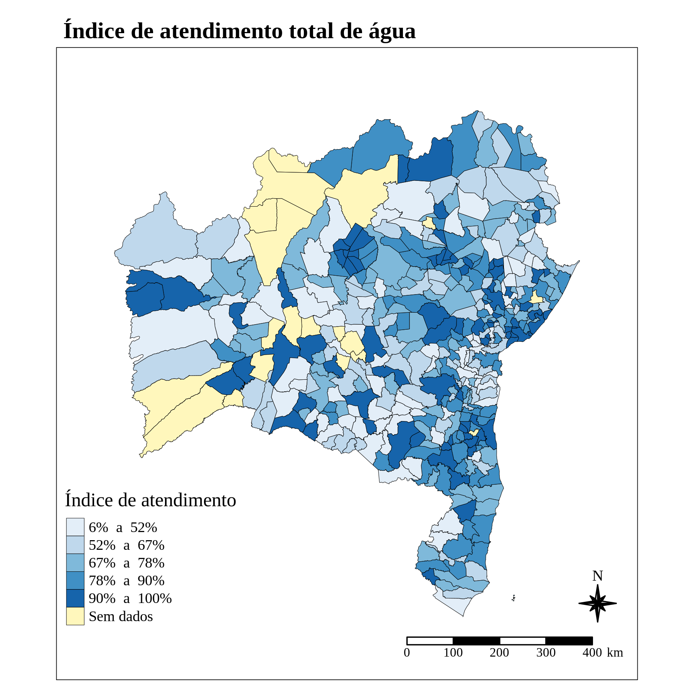
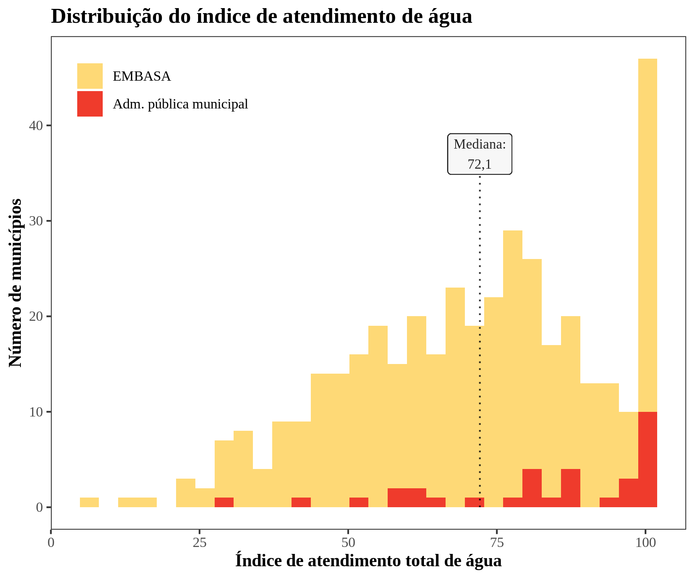

```{r, echo = FALSE, message = FALSE, warning = FALSE}
library(tidyverse)
snis_agua <- readRDS('data/snis-agua-clean.rds')
snis_esgoto <- readRDS('data/snis-esgoto-clean.rds')
```

# Introdução
Este boletim apresenta um breve panorama dos serviços saneamento básico prestados aos municípios do Estado da Bahia. O objetivo é descrever alguns aspectos do fornecimento de água, bem como dos serviços de coleta e tratamento de esgoto, apresentando indicadores relativos aos níveis de atendimento, tarifas, desempenho financeiro, investimentos, entre outros. Além disso, busca-se analisar a distribuição dos diferentes arranjos jurídicos para prestação desses serviços na Bahia.

Os dados apresentados referem-se ao ano de 2018 e foram obtidos a partir do Sistema Nacional de Informações Sobre Saneamento (SNIS). Criado em 1996, o SNIS é o maior e mais importante sistema de informações do setor de saneamento do Brasil. No que se refere a dados de água e esgoto, as informações disponíveis são fornecidas pelas instituições responsáveis pela prestação dos serviços, tais como autarquias, departamentos municipais, companhias estaduais e empresas públicas e
privadas.

# Tipos de Prestadores de Serviços
A Figura 1, a seguir, apresenta a distribuição geográfica dos tipos de empresa que fornecem água aos municípios baianos.

```{r mapa-tipo-prestador-agua, fig.cap = "Mapa - Natureza Juridica - Água", echo = FALSE}

```

Nota-se que a EMBASA é responsável por atender a maioria dos municípios baianos. De fato, como detalhado na tabela abaixo, a EMBASA fornece água para 366 dos 417 municípios da Bahia. Deste total, a EMBASA é a única fornecedora de água em 360 municípios e em outros 6 a empresa divide a responsabilidade com a Prefeitura Municipal.

```{r, echo = FALSE, fig.cap =  'Tabela 1'}
snis_agua %>% 
  count(nat_jur_simplified2, .drop = FALSE) %>% 
  arrange(desc(n)) %>% 
  mutate(nat_jur_simplified2 = ifelse(is.na(nat_jur_simplified2),
                                      'Sem dados', nat_jur_simplified2)) %>% 
  rename(`Tipo de prestador` = nat_jur_simplified2,
         `Municípios atendidos` = n) %>% 
  knitr::kable()
```

A Figura 2 é semelhante ao mapa anterior, mas refere-se ao fornecimento de serviços de esgotamento sanitário. A imagem é complementada pela tabela a seguir.

```{r mapa-tipo-prestador-esgoto, fig.cap = "Mapa - Natureza Jurídica - Esgoto", echo = FALSE}
knitr::include_graphics("plots/esgoto/mapa-tipo-prestador-esgoto.png")
```

```{r, echo = FALSE}
count_esgoto <- snis_esgoto %>% 
  count(nat_jur_simplified2, .drop = FALSE) %>% 
  arrange(desc(n)) %>% 
  mutate(nat_jur_simplified2 = ifelse(is.na(nat_jur_simplified2),
                                      'Sem dados', nat_jur_simplified2)) %>% 
  rename(`Tipo de prestador` = nat_jur_simplified2,
         `Municípios atendidos` = n)

knitr::kable(count_esgoto)
```

Nota-se primeiramente, a indisponibilidade de dados relativos a serviços de esgotamento para um grande número de municípios (259). Dentre 158 para os quais existem dados, a EMBASA é responsável por atender cerca de 66,5%.

# Atendimento de água
A Figura 3 retrata um mapeamento dos municípios baianos conforme índice de atendimento de água. Esse indicador é o percentual da população total atendida com abastecimento de água, em relação à população total residente no município.

```{r mapa-atendimento-agua, fig.cap = "Mapa - Índice de Atendimento de Água", echo = FALSE}

```

Nas Figuras 4 e 5, são apresentadas as distribuições dos índices municipais de atendimento. Considerando todos os municípios do Estado, a mediana do índice de atendimento é de 72,1%. Quando se segmenta segundo o tipo de prestador de serviço, observa-se que a mediana dos municípios atendidos pela EMBASA é 71,3% - portanto, bastante próxima da mediana estadual, como esperado em razão do grande número de municípios atendidos pela empresa. Os municípios atendidos pela Administração Pública municipal, contudo, tendem a ter índices de atendimento um pouco superiores, com uma mediana de 85,9%.

```{r histograma-atendimento-agua, fig.cap = "Histograma - Índice de Atendimento de Água", echo = FALSE}

```

```{r boxplot-atendimento-agua, fig.cap = "Boxplot - Índice de Atendimento de Água", echo = FALSE}

```

# Tarifa de água
A Figura 6 apresenta o mapeamento dos municípios conforme a tarifa média do serviço de fornecimento de água cobrada por metro cúbico (m3). A distribuição varia de R\$0,02 (Ibicaraí) à R\$29,9/m3 (Serrinha). No mapa, é possível observar que as tarifas tendem a ser mais altas em municípios situados no Leste e no Sul do estado.

```{r mapa-tarifa-agua, fig.cap = "Mapa - Tarifa Média de Água", echo = FALSE}

```

A Figura 7 apresenta as distribuições das tarifas médias municipais, segmentadas por tipo de prestador. Atentando para a diferença de escala entre os painéis, nota-se que a mediana dos municípios atendidos pela EMBASA é mais elevada do que àquela verificada nos municípios atendidos pela Administração Pública municipal. Além disso, observa-se que a distribuição das tarifas médias dos municípios atendidos pela EMBASA apresenta uma longa cauda à direita, com um pequeno grupo de municípios com tarifas médias muito superiores aos valores praticados no restante do Estado. A título ilustrativo, os seguintes municípios apresentam tarifas médias de água entre R\$25 e R\$30: Condeúba, Teofilândia, Jaguarari, Acajutiba, Biritinga, Barrocas, Candeias, Aporá e Serrinha.

```{r boxplot-tarifa-agua, fig.cap = "Boxplot - Tarifa de Água", echo = FALSE}
knitr::include_graphics("plots/agua/boxplot-tarifa-agua.png")
```

# Coleta de esgoto
Na base de dados do SNIS, o índice de coleta de esgoto representa a razão, em termos percentuais, do volume de esgotos coletado sobre a o total de água consumido no município. A distribuição geográfica desse indicador no Estado da Bahia é apresentada na Figura 8. Como fica evidente no mapa, não há dados relativos à coleta de esgota para um grande número de municípios (292 de um total de 417). Dentre os demais, observa-se que uma parcela substancial é situada na parte leste do Estado.

```{r mapa-coleta-esgoto, fig.cap = "Mapa - Índice de Coleta de Esgoto", echo = FALSE}

```

O mapa é complementado pela Figura 9, que apresenta o número de municípios dentro de cada faixa do índice de coleta, considerando apenas os 125 municípios para os quais há dados disponíveis. A faixa com os menores índices de coleta (até 25%) é aquela com o maior número de municípios (42). Além disso, vê-se que 63 municípios - ou seja aproximadamente metade dos 125 - apresentam índice de coleta inferior a 50%.

```{r barplot-coleta-esgoto, fig.cap = "Gráfico de barras - Faixas de coleta de esgoto", echo = FALSE}

```

# Tratamento de esgoto
A Figura 10 mostra a situação dos municípios baianos quanto ao índice de tratamento de esgoto relativo ao consumo de água. Nesse índice, um valor de 100% significa que o volume tratado de esgoto com origem no município é igual ao volume de água ali consumido.

```{r mapa-tratamento-esgoto, fig.cap = "Mapa - Índice de Tratamento de Esgoto", echo = FALSE}

```

Na Figura 11, apresenta-se a contagem de municípios dentro de cada uma de quatro faixas de índice de tratamento. Novamente, a faixa com o maior número de municípios (52) é aquela referente aos menores índices de tratamento. Além disso, 73 municípios apresentam índice de tratamento inferior a 50%, o que representa cerca de 58% dos 125 municípios para os quais os dados estão disponíveis.

```{r barplot-tratamento-esgoto, fig.cap = "Gráfico de Barras - Faixas de tratamento de esgoto", echo = FALSE}

```

# Tarifa do serviço de esgotamento
A Figura 12 ilustra a distribuição geográfica das tarifas médias, por metro cúbico, do serviço de esgotamento sanitário cobradas nos municípios baianos A distribuição varia de R\$0,00/m3 (São Félix) a R\$6,47/m3 (Mata de São João).

```{r mapa-tarifa-media-esgoto, fig.cap = "Mapa - Tarifa Média de Esgoto", echo = FALSE}

```

A Figura 13, por sua vez, apresenta um histograma das tarifas médias cobradas nos municípios baianos pelo serviço de esgotamento, com a indicação do tipo de prestador. Considerando todos os 116 municípios para os quais os dados tarifários estão disponíveis, tem-se uma mediana de R\$3,40 por metro cúbico. Nota-se também que esse valor é superior às tarifas médias cobradas pelos municípios atendidos pela Administração Pública municipal.

```{r histograma-tarifa-esgoto, fig.cap = "Histograma - Tarifa Média de Esgoto", echo = FALSE}

```

# Investimento na rede de água e esgoto
Em relação aos investimentos realizados pelos prestadores de serviços, o SNIS registra levantamento do valor do investimento realizado no ano de referência, diretamente ou por meio de contratos celebrados pelo próprio prestador de serviços, em equipamentos e instalações incorporados aos sistemas de água e esgoto. A base de dados também contém dados relativos a investimentos realizados pelos próprios municípios ou pelo governo estadual, na rede de saneamento de cada município. Dessa forma, é possível calcular o investimento total realizado em cada município. Dividindo esse valor pela população, obtém-se o investimento total per capita, cuja distribuição geográfica é apresentada na Figura 14. A imagem mostra que a maior parte dos municípios baianos apresenta níveis bastante baixos (abaixo de R\$ por habitante) de investimento.

```{r mapa-investimento, fig.cap = "Mapa - Investimento total per capita", echo = FALSE}

```

# Desempenho financeiro
Em linhas gerais, o indicador de desempenho financeiro disponível no SNIS é um índice que reflete a razão entre o total de receitas e o total de despesas com os serviços de saneamento, em termos percentuais. Um índice de desempenho financeiro elevado indica que as receitas do prestador de serviços são bastante superiores a suas despesas. A Figura 15 apresenta, na forma de mapa, os índices de desempenho financeiro dos prestadores de serviços de água e esgoto nos municípios baianos.

```{r mapa-desempenho, fig.cap = "Mapa - Indicador de Desempenho Financeiro", echo = FALSE}

```

# Perdas de faturamento
Simplificadamente, o índice de perda de faturamento é um indicador que busca aferir o volume de água que cada prestador de serviços deixa de faturar, como percentual do total de água produzida (ou importada de outros prestadores). Assim, um prestador de serviços que fatura toda a água que produz terá índice de perda igual a zero. Em contraste, um prestador de serviços que fornece água gratuitamente terá índice de perda igual a 100. A Figura 16 apresenta a distribuição geográfica dos índices de perdas de faturamento no Estado da Bahia.

```{r mapa-perdas, fig.cap = "Mapa - Índice de Perdas de Faturamento", echo = FALSE}

```

Complementando o mapa acima, a Figura 17 apresenta a distribuição dos índices de perdas de faturamento, com a indicação do tipo de prestador de serviços (EMBASA ou Administração Pública municipal, direta ou indireta).

```{r histograma-perdas, fig.cap = "Histograma - Índice de Perdas de Faturamento", echo = FALSE}

```

# Correlação entre indicadores
Além de analisar a distribuição de cada um dos indicadores mencionados acima, também é interessante investigar como eles se relacionam entre si e com outras variáveis de interesse.

## Matrizes de correlação

A Figura 18, a seguir, apresenta a matriz de correlação de variáveis selecionadas para todos os 383 municípios para os quais há dados completos no que diz respeito aos indicadores de fornecimento de água, perdas de faturamento, investimento per capita e desempenho financeiro.

```{r corr-plot-agua, fig.cap = "Matriz de correlação - Sem variáveis de esgoto", echo = FALSE}

```

Para incluir indicadores relativos ao serviço de esgotamento em uma análise semelhante, é necessário restringir o número de municípios considerado, uma vez que a maior parte dos municípios baianos não registra dados referentes a esgoto no SNIS. A Figura 19, a seguir, apresenta a matriz de correlação para um conjunto estendido de variáveis, considerando apenas os 112 municípios para os quais se têm dados completos.

```{r corr-plot-agua-esgoto, fig.cap = "Matriz de correlação - Com variáveis de esgoto", echo = FALSE}

```

## Gráficos de dispersão
[AVALIAR SE DEVEM SER INCLUÍDOS OS GRÁFICOS A SEGUIR]

```{r scatterplot-atendimento-agua-vs-pib-per-capita, fig.cap = "Atendimento de água vs. PIB per capita", echo = FALSE}

```

```{r scatterplot-tarifa-agua-vs-pib-per-capita, fig.cap = "Tarifa média de água vs. PIB per capita", echo = FALSE}

```

```{r scatterplot-tarifa-vs-coleta-esgoto, fig.cap = "Tarifa média de esgoto vs. Índice de coleta de Esgoto", echo = FALSE}

```

```{r scatterplot-tarifa-vs-tratamento-esgoto, fig.cap = "Tarifa de esgoto vs. Índice de Tratamento de Esgoto", echo = FALSE}

```


# Ranking de municípios

Por fim, é interessante calcular algum indicador que permita ordenar os municípios segundo a qualidade dos serviços de saneamento oferecido a seus habitantes, incorporando informações dos diversos indicadores detalhados nesse trabalho. No entanto, como não há dados relativos aos serviços de esgotamento para a maior parte dos municípios paulistas, não é possível construir um ranking que considere, simultaneamente, o maior número possível de variáveis e o maior número possível de municípios. Por esse motivo, são construídos dois rankings: um que considera 383 municípios mas não incorpora informações relativas à tarifa de esgoto, índice de coleta e índice de tratamento; e outro que leva em conta essas variáveis, mas considera apenas 112 municípios. 

## Ranking 1 (383 municípios, sem variáveis de esgoto)  

Média simples dos valores normalizados das seguintes variáveis: índice de atendimento de água, tarifa de água, indicador de perdas de faturamento, investimento per capita e indicador de desempenho financeiro.

A tabela a seguir apresenta dados dos dez municípios que apresentaram os melhores resultados:

```{r, echo = FALSE}
highlights_agua <- readRDS('data/highlights_agua.rds') %>% 
  select(`Município` = municipio, `Score` = score,
         `Atend.` = atendimento, `Tar. água` = tarifa_agua,
         `Perdas` = perdas, `Inv.` = inv_per_capita, `Des. Fin.` = desempenho)

highlights_agua %>% slice(1:10) %>% knitr::kable(digits = 1)
```

Por sua vez, a tabela a seguir apresenta os dados dos 10 municípios que obtiveram os piores resultados:

```{r, echo = FALSE}
highlights_agua %>% arrange(Score) %>% slice(1:10) %>% knitr::kable(digits = 1)
```

A Figura 24 apresenta a distribuição das pontuações obtidas pelos municípios.

```{r fig.cap = "Histograma - Pontuação - Ranking 1", echo = FALSE}
knitr::include_graphics("plots/histogram-ranking-agua.png")
```

## Ranking 2 (112 municípios, com variáveis de esgoto)

Média simples dos valores normalizados das seguintes variáveis: índice de atendimento de água, índice de coleta de esgoto, índice de tratamento de esgoto (relativo ao consumo total de água), tarifa de água, tarifa de esgoto, indicador de perdas de faturamento, investimento per capita, indicador de desempenho financeiro.

A tabela a seguir apresenta dados dos dez municípios que apresentaram os melhores resultados:

```{r, echo = FALSE}
highlights_agua_esgoto <- readRDS('data/highlights_agua_esgoto.rds') %>% 
  select(`Município` = municipio, `Score` = score, `Atend.` = atendimento,
         `Coleta` = coleta, `Trat.` = tratamento,
         `Tar. água` = tarifa_agua, `Tar. esgoto` = tarifa_esgoto,
         `Perdas` = perdas, `Inv.` = inv_per_capita, `Des. Fin.` = desempenho)

highlights_agua_esgoto %>% slice(1:10) %>% knitr::kable(digits = 1)
```

Por sua vez, a tabela a seguir apresenta os dados dos 10 municípios que obtiveram os piores resultados:

```{r, echo = FALSE}
highlights_agua_esgoto %>% arrange(Score) %>% slice(1:10) %>% knitr::kable(digits = 1)
```

A Figura 25 apresenta a distribuição das pontuações obtidas pelos municípios.

```{r fig.cap = "Histograma - Pontuação - Ranking 2", echo = FALSE}
knitr::include_graphics("plots/histogram-ranking-agua-esgoto.png")
```
